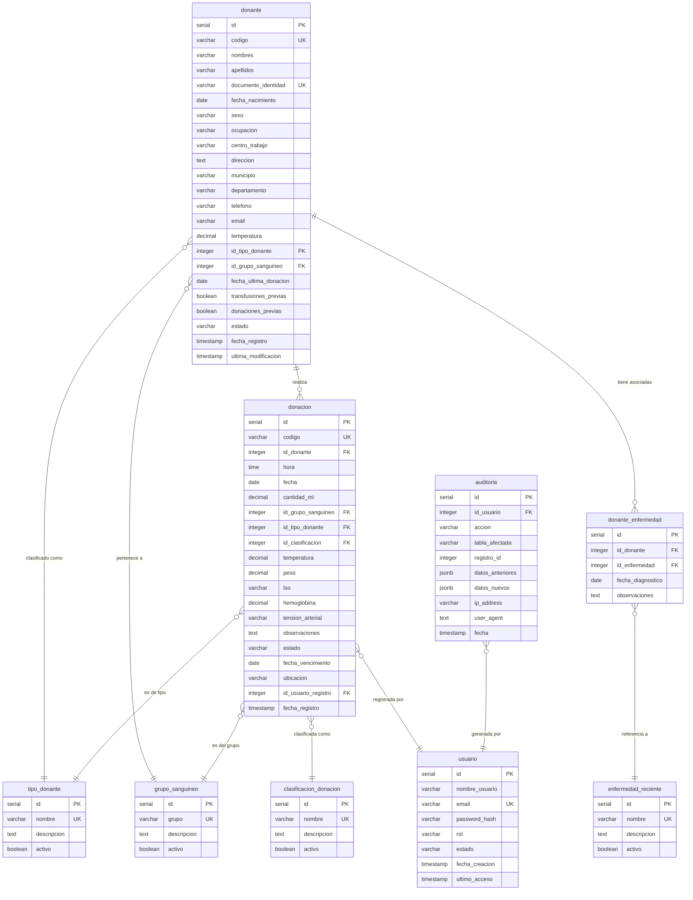

# Diagrama Entidad-Relación

El siguiente diagrama muestra la estructura completa de la base de datos con todas las tablas, campos y relaciones entre ellas. Utiliza notación Mermaid `erDiagram`.

> Para visualizar este diagrama, abrir el archivo en VS Code con la extensión **Markdown Preview Mermaid Support**, o pegarlo en [mermaid.live](https://mermaid.live).

---

---

## Descripción de la Notación

| Símbolo | Significado |
|---------|-------------|
| `PK` | Primary Key — clave primaria |
| `FK` | Foreign Key — clave foránea |
| `UK` | Unique Key — valor único en la tabla |
| `\|\|--o{` | Uno a muchos: un registro de la izquierda relacionado con cero o más de la derecha |
| `}o--\|\|` | Muchos a uno: cero o más registros de la izquierda relacionados con exactamente uno de la derecha |

---

## Notas del Diagrama

- **`donante` → `donacion`**: Un donante puede tener registradas cero o muchas donaciones a lo largo del tiempo.
- **`donante` → `donante_enfermedad`**: Un donante puede tener cero o muchas enfermedades recientes asociadas.
- **`donante` → `tipo_donante`**: Un donante tiene un tipo de donante principal (puede ser NULL en datos incompletos).
- **`donante` → `grupo_sanguineo`**: Un donante pertenece a un grupo sanguíneo (puede ser NULL si no se conoce).
- **`donacion` → `tipo_donante`**: Cada donación especifica el tipo en que fue realizada.
- **`donacion` → `grupo_sanguineo`**: Cada donación registra el grupo sanguíneo de la unidad donada.
- **`donacion` → `clasificacion_donacion`**: Cada donación se clasifica como ÚTIL o NO ÚTIL.
- **`donacion` → `usuario`**: Registra qué usuario del sistema ingresó la donación.
- **`donante_enfermedad` → `enfermedad_reciente`**: Vincula una entrada de la tabla de relación con la enfermedad específica del catálogo.
- **`auditoria` → `usuario`**: Cada evento de auditoría registra qué usuario lo originó.
