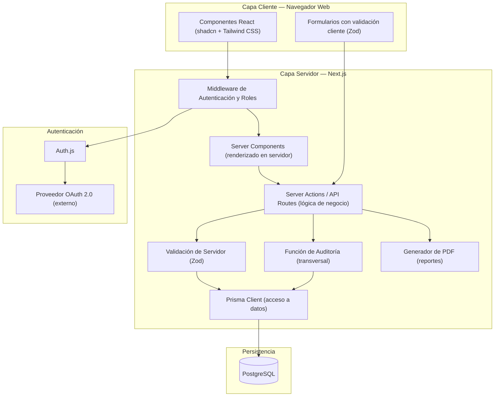
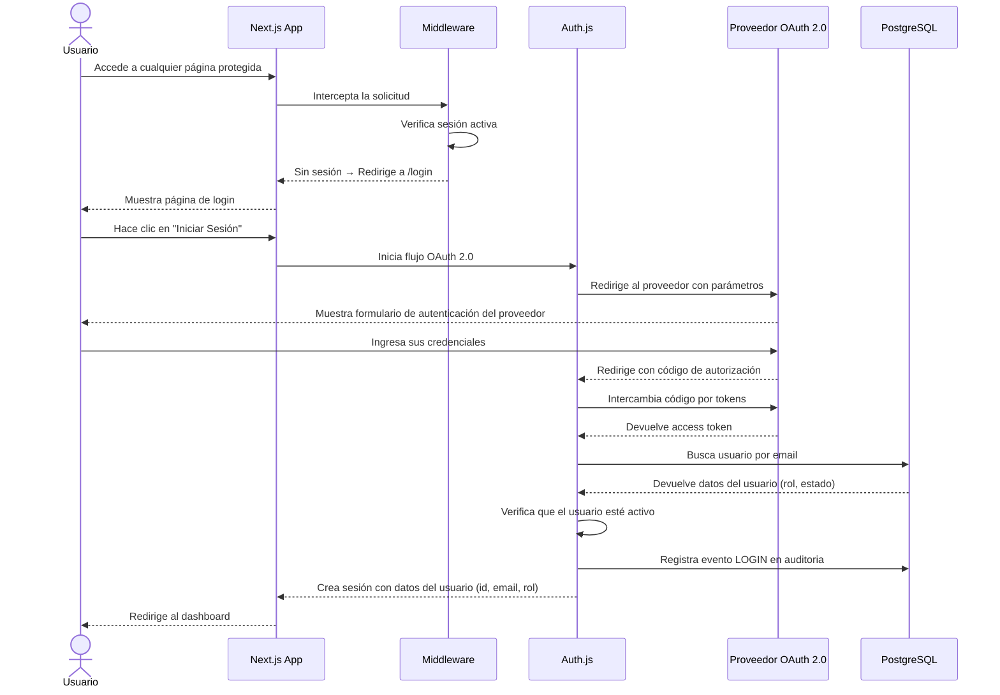
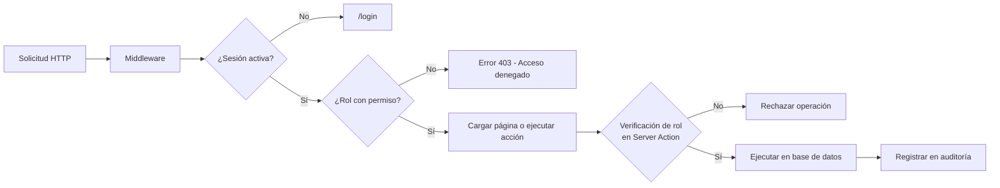

# Arquitectura del Sistema

Este documento describe la arquitectura general del sistema Banco de Sangre, la organización de sus capas y cómo interactúan entre sí.

---

## 1. Tipo de Arquitectura

El sistema utiliza una arquitectura **full-stack monolítica en Next.js**, también conocida como patrón **BFF (Backend for Frontend)**. El framework Next.js gestiona tanto el renderizado de las páginas del cliente como la lógica del servidor en un único proyecto desplegado.

Esta arquitectura es apropiada para este proyecto porque:
- El equipo de desarrollo es pequeño y no requiere separar equipos de frontend y backend.
- Simplifica el despliegue a un único servidor o plataforma.
- Next.js provee mecanismos de seguridad integrados (CSRF, validación de sesión en middleware).
- Reduce la latencia al evitar llamadas de red adicionales entre frontend y backend separados.

---

## 2. Capas del Sistema

El sistema se organiza en cuatro capas lógicas:

| Capa | Tecnología | Responsabilidad |
|------|------------|-----------------|
| **Presentación** | React + shadcn + Tailwind CSS | Renderizado de páginas, formularios, tablas y componentes visuales |
| **Aplicación** | Next.js Middleware + Server Actions + API Routes | Lógica de negocio, validación de entradas, autenticación, autorización |
| **Datos** | Prisma ORM | Abstracción de acceso a la base de datos, consultas parametrizadas |
| **Persistencia** | PostgreSQL | Almacenamiento persistente de todos los datos del sistema |

---

## 3. Diagrama de Arquitectura General



---

## 4. Flujo General de una Solicitud

Toda solicitud HTTP al sistema sigue el siguiente flujo:

```
1. El usuario hace una acción en la interfaz (navegar a una página, enviar formulario)
2. Next.js Middleware intercepta la solicitud
3. Middleware verifica si hay sesión activa:
   → Sin sesión: redirige a /login
   → Con sesión: continúa
4. Middleware verifica si el rol del usuario tiene permiso para la ruta solicitada:
   → Sin permiso: devuelve error 403
   → Con permiso: continúa
5. El Server Component o Server Action recibe la solicitud
6. Se validan los datos de entrada con Zod en el servidor
7. Prisma ejecuta la consulta parametrizada a PostgreSQL
8. Si es una operación de escritura, se registra el evento en la tabla auditoria
9. La respuesta se devuelve al cliente
10. La interfaz actualiza su estado y muestra la confirmación o el error al usuario
```

---

## 5. Diagrama de Flujo de Autenticación



---

## 6. Control de Acceso por Roles (RBAC)

El control de acceso se implementa en dos niveles:

**Nivel 1 — Middleware de Rutas:**
El middleware de Next.js verifica la sesión en cada solicitud. Antes de que la página se cargue, el middleware determina si el rol del usuario tiene acceso a la ruta solicitada.

**Nivel 2 — Server Actions y API Routes:**
Cada acción de escritura (crear, editar, desactivar) verifica nuevamente el rol del usuario en el servidor antes de ejecutar la operación. Esto previene que un atacante acceda directamente al endpoint de la API aunque conozca la URL.



---

## 7. Gestión de Sesiones

- Las sesiones se crean mediante Auth.js al completar el flujo OAuth 2.0.
- La sesión se almacena como un JWT firmado con `NEXTAUTH_SECRET` o en base de datos según la configuración.
- La sesión incluye: ID de usuario, nombre, email y rol.
- Las sesiones expiran automáticamente tras el período de inactividad configurado.
- Al cerrar sesión, el token de sesión es invalidado en el servidor.

---

## 8. Gestión de Datos Sensibles

- Toda comunicación entre el cliente y el servidor ocurre bajo HTTPS en producción.
- Las credenciales de base de datos, los secretos de OAuth y el secreto de sesión se almacenan en variables de entorno, nunca en el código fuente.
- El ORM Prisma utiliza consultas parametrizadas en todas las operaciones, eliminando el riesgo de inyección SQL.
- Los datos de la sesión que se exponen al cliente no incluyen información sensible más allá del nombre, email y rol del usuario.

---

## 9. Estrategia de Auditoría

La auditoría es un componente transversal del sistema. Se implementa como una función reutilizable que se llama desde cualquier Server Action o API Route que modifique datos.

Cada registro de auditoría almacena:
- El usuario que realizó la acción.
- El tipo de acción (CREATE, UPDATE, DELETE, LOGIN, LOGOUT).
- La tabla y el ID del registro afectado.
- Un snapshot del estado anterior y posterior del registro (formato JSONB).
- La dirección IP y el User-Agent del cliente.
- La fecha y hora exacta del evento.

Los registros de auditoría son de **solo inserción**: ningún rol puede modificarlos ni eliminarlos.
