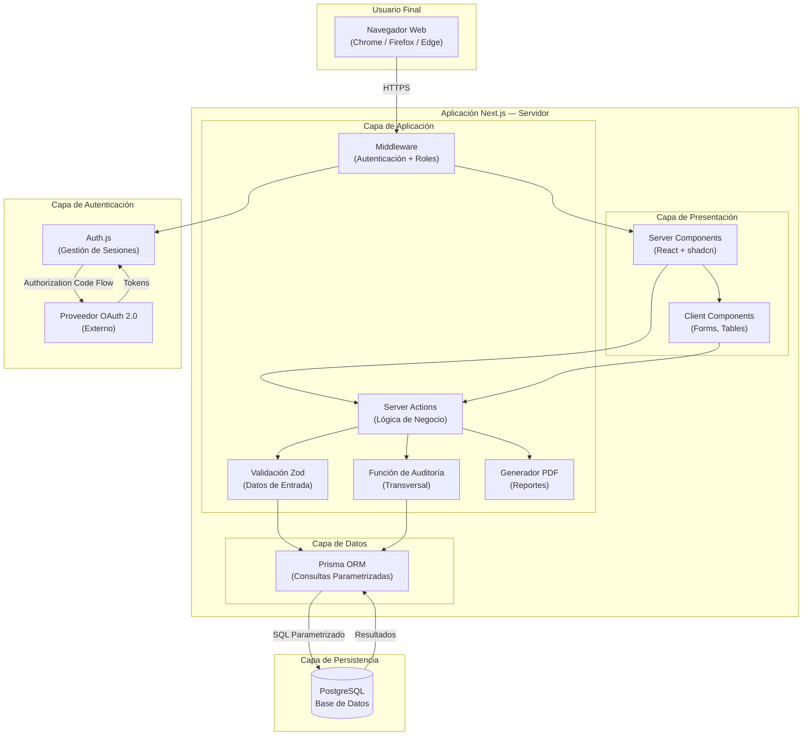
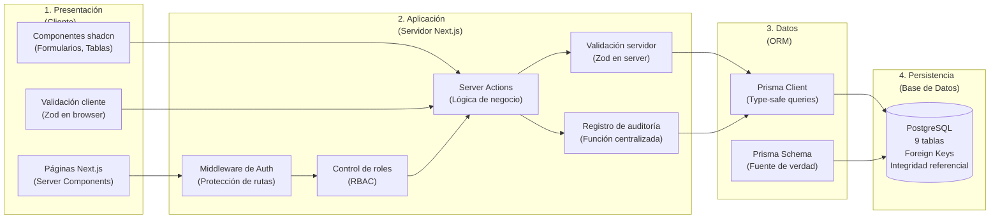
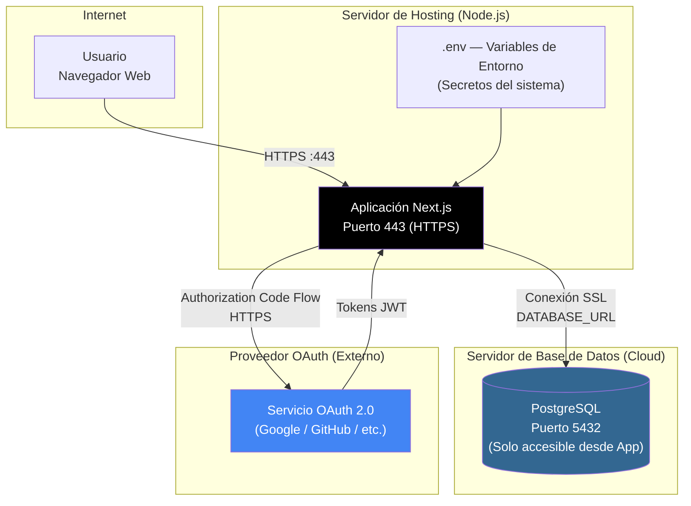
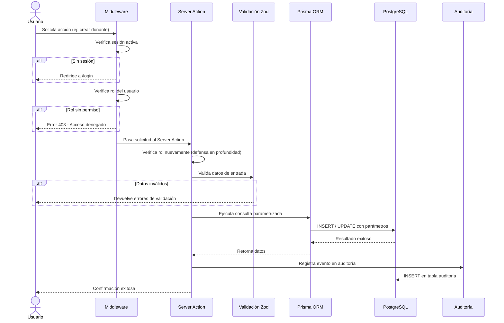

# Diagrama de Arquitectura del Sistema

Este diagrama muestra la arquitectura completa del sistema Banco de Sangre, incluyendo las capas de presentación, aplicación, datos y persistencia, así como los flujos de comunicación entre ellas.

> Para visualizar estos diagramas, abrir en VS Code con la extensión **Markdown Preview Mermaid Support**, o pegar en [mermaid.live](https://mermaid.live).

---

## 1. Arquitectura General del Sistema

---

## 2. Diagrama de Capas con Responsabilidades

---

## 3. Diagrama de Despliegue

---

## 4. Flujo de una Solicitud Protegida

