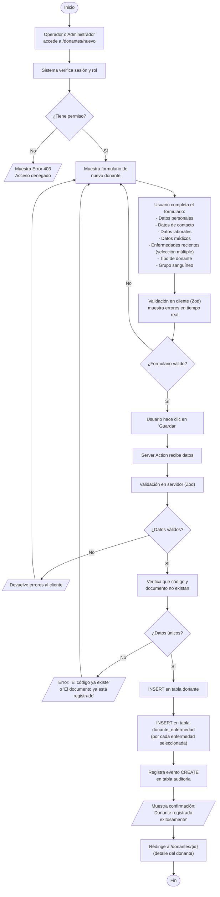
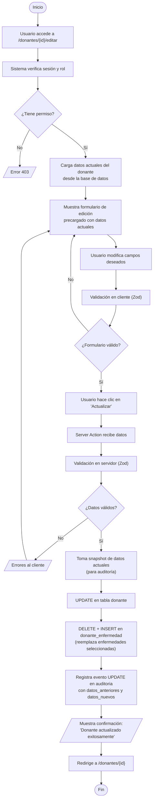
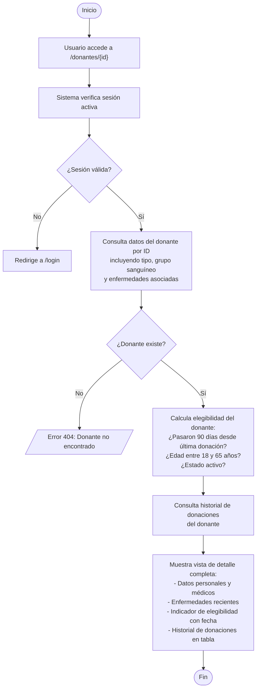
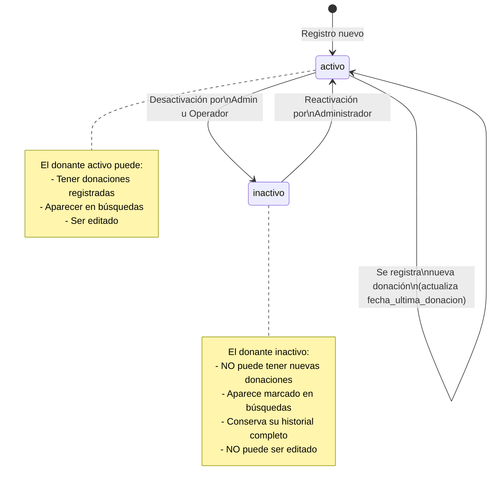
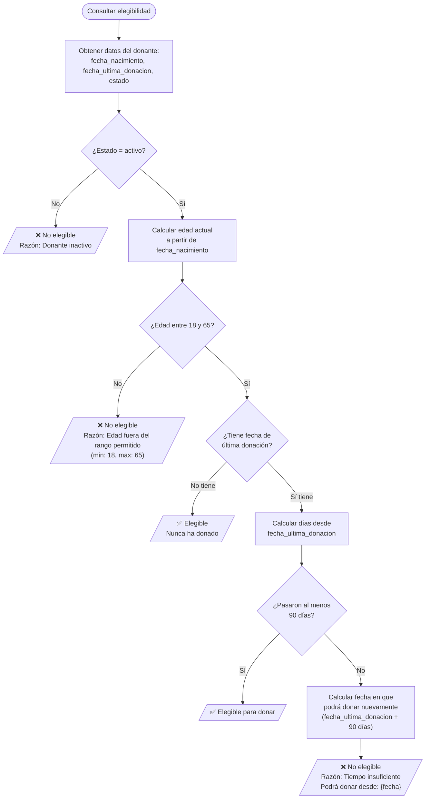

# Diagrama de Flujo — Gestión de Donantes

Este documento muestra los flujos de los procesos principales del módulo de Gestión de Donantes.

> Para visualizar estos diagramas, abrir en VS Code con la extensión **Markdown Preview Mermaid Support**, o pegar en [mermaid.live](https://mermaid.live).

---

## 1. Flujo de Registro de Nuevo Donante

---

## 2. Flujo de Edición de Donante

---

## 3. Flujo de Consulta de Detalle del Donante

---

## 4. Diagrama de Estados del Donante

---

## 5. Flujo de Verificación de Elegibilidad

