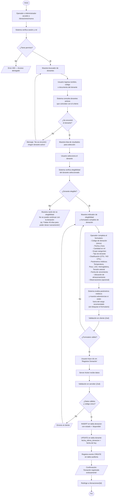
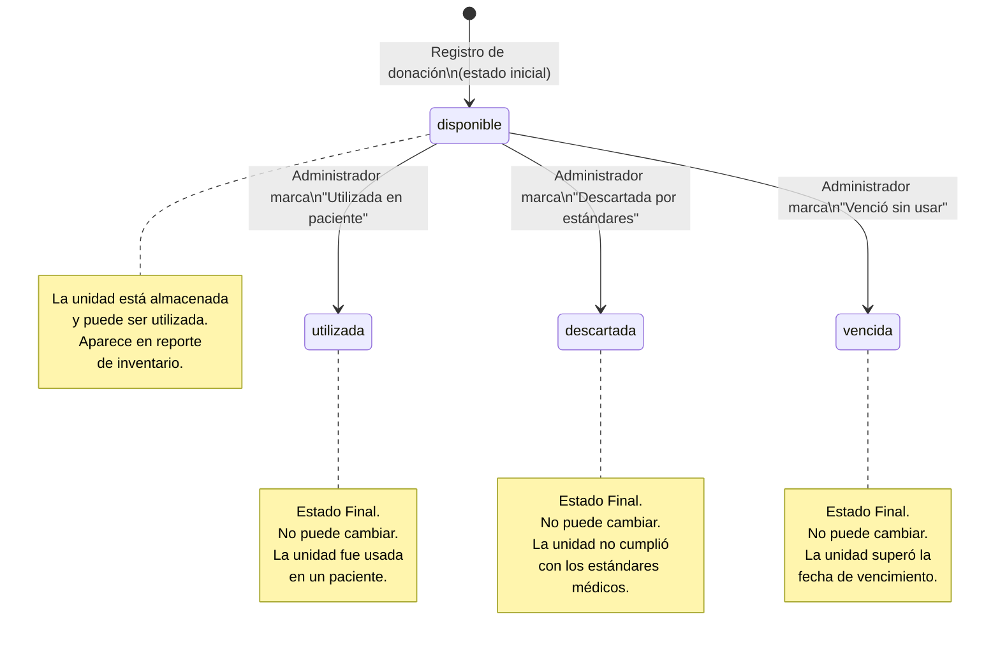
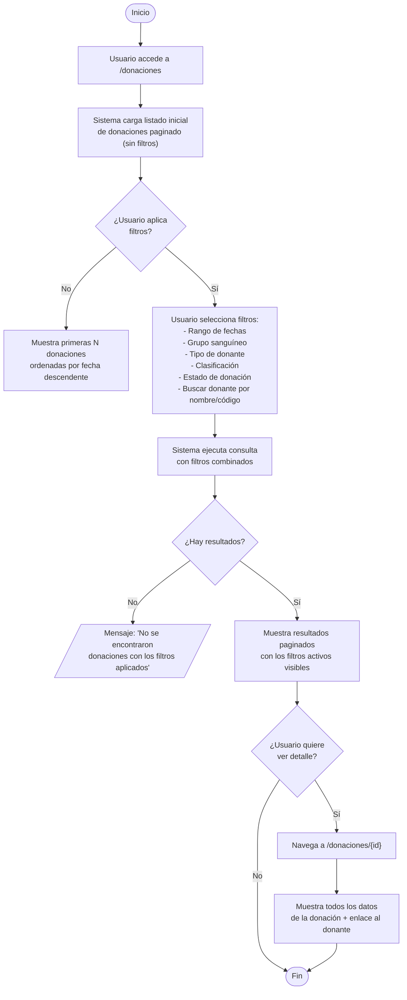
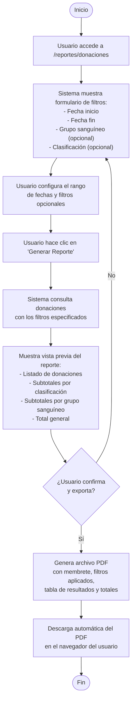

# Diagrama de Flujo — Gestión de Donaciones

Este documento muestra los flujos de los procesos principales del módulo de Gestión de Donaciones.

> Para visualizar estos diagramas, abrir en VS Code con la extensión **Markdown Preview Mermaid Support**, o pegar en [mermaid.live](https://mermaid.live).

---

## 1. Flujo de Registro de Nueva Donación



---

## 2. Flujo de Cambio de Estado de Donación (Solo Administrador)

```mermaid
flowchart TD
    A([Inicio]) --> B["Administrador accede a /donaciones/{id}"]
    B --> C["Sistema verifica rol = administrador"]
    C --> D{¿Es Administrador?}
    D -- No --> E["Botón de cambio de estado\nno se muestra en la interfaz"]
    D -- Sí --> F["Muestra opciones de estado\nsegún transiciones permitidas"]
    F --> G{Estado actual de\nla donación}
    G -- disponible --> H["Muestra opciones:\n→ Marcar como Utilizada\n→ Marcar como Descartada\n→ Marcar como Vencida"]
    G -- utilizada --> I[/"Estado final — No se puede cambiar"\nMuestra solo lectura]
    G -- descartada --> J[/"Estado final — No se puede cambiar"\nMuestra solo lectura]
    G -- vencida --> K[/"Estado final — No se puede cambiar"\nMuestra solo lectura]
    H --> L["Administrador selecciona\nel nuevo estado"]
    L --> M["Sistema muestra confirmación:\n'¿Está seguro de cambiar el estado\na {nuevo_estado}? Esta acción no se puede deshacer.'"]
    M --> N{¿Confirma?}
    N -- No --> F
    N -- Sí --> O["Server Action valida rol\n(verificación en servidor)"]
    O --> P["Toma snapshot del estado anterior"]
    P --> Q["UPDATE estado en tabla donacion"]
    Q --> R["Registra evento UPDATE\nen tabla auditoria"]
    R --> S[/"Confirmación exitosa\nMuestra el nuevo estado"/]
    S --> Z([Fin])
```

---

## 3. Diagrama de Estados de una Donación



---

## 4. Flujo de Búsqueda y Filtrado de Donaciones



---

## 5. Flujo de Generación de Reporte de Donaciones (PDF)


