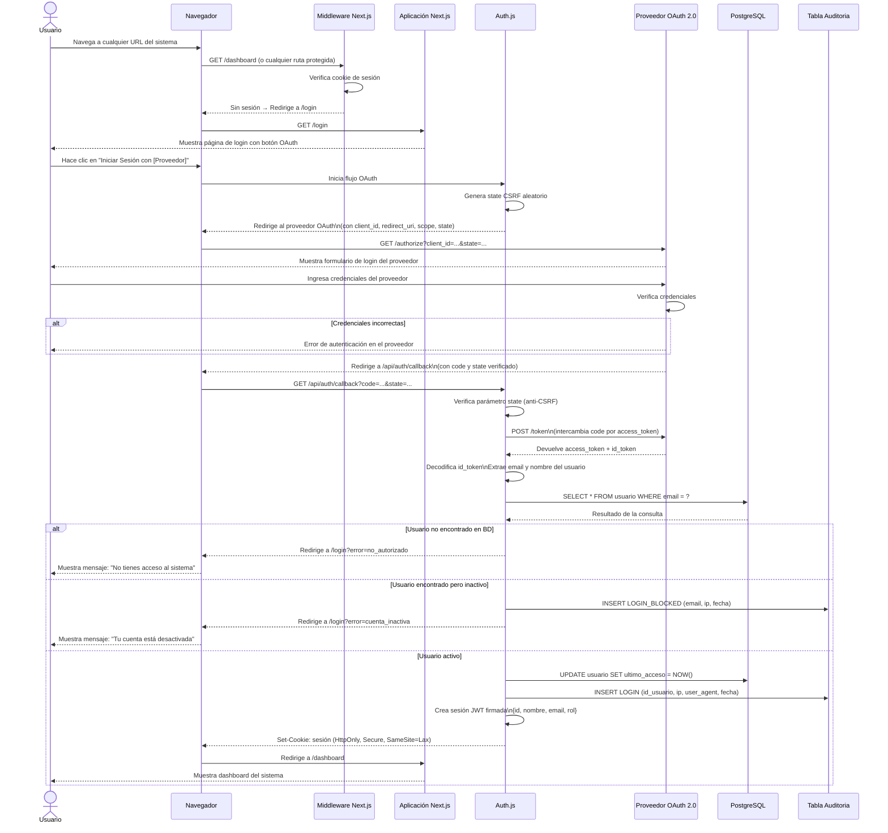
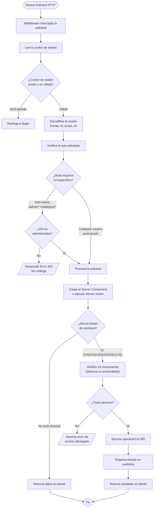
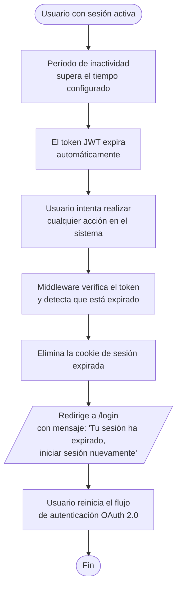
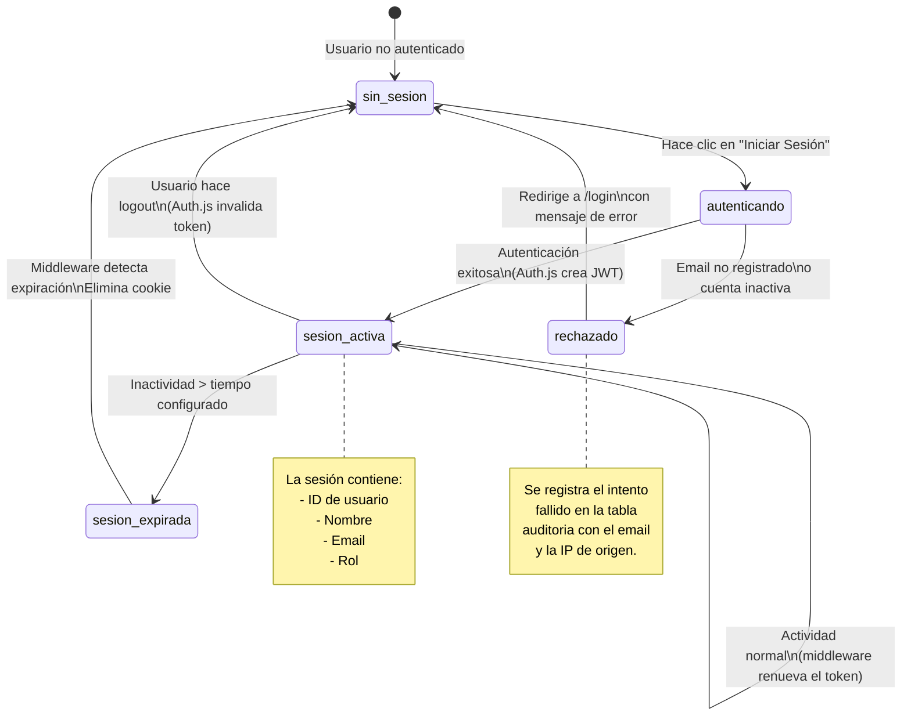

# Diagrama de Flujo — Autenticación OAuth 2.0

Este documento muestra en detalle el flujo de autenticación del sistema utilizando OAuth 2.0, incluyendo los casos de acceso denegado y cierre de sesión.

> Para visualizar estos diagramas, abrir en VS Code con la extensión **Markdown Preview Mermaid Support**, o pegar en [mermaid.live](https://mermaid.live).

---

## 1. Flujo Completo de Autenticación OAuth 2.0



---

## 2. Flujo de Verificación de Rol en Cada Solicitud



---

## 3. Flujo de Cierre de Sesión

```mermaid
sequenceDiagram
    actor U as Usuario
    participant B as Navegador
    participant AUTHJS as Auth.js
    participant DB as PostgreSQL
    participant AUDIT as Tabla Auditoria

    U->>B: Hace clic en "Cerrar Sesión"
    B->>AUTHJS: POST /api/auth/signout
    AUTHJS->>AUTHJS: Invalida el token de sesión\nen el servidor
    AUTHJS->>AUDIT: INSERT LOGOUT (id_usuario, ip, fecha)
    AUDIT-->>AUTHJS: Confirmación
    AUTHJS-->>B: Elimina la cookie de sesión\n(Set-Cookie: sesión=; Max-Age=0)
    B-->>U: Redirige a /login
    
    note over B,AUTHJS: Si el usuario intenta navegar hacia atrás\nel middleware verifica que no hay sesión válida\ny redirige a /login nuevamente
```

---

## 4. Flujo de Sesión Expirada



---

## 5. Diagrama de Estados de Sesión de Usuario



---

## 6. Matriz de Acceso por Rol y Ruta

```mermaid
graph LR
    subgraph Rutas Públicas
        R0["/login"]
    end

    subgraph Rutas — Todos los Roles
        R1["/dashboard"]
        R2["/donantes/*"]
        R3["/donaciones/*"]
        R4["/reportes/*"]
    end

    subgraph Rutas — Solo Administrador
        R5["/catalogos/*"]
        R6["/admin/usuarios/*"]
        R7["/admin/auditoria"]
    end

    Admin([Administrador]) --> R0
    Admin --> R1
    Admin --> R2
    Admin --> R3
    Admin --> R4
    Admin --> R5
    Admin --> R6
    Admin --> R7

    Operador([Operador]) --> R0
    Operador --> R1
    Operador --> R2
    Operador --> R3
    Operador --> R4

    Consulta([Consulta]) --> R0
    Consulta --> R1
    Consulta --> R2
    Consulta --> R3
    Consulta --> R4
```
